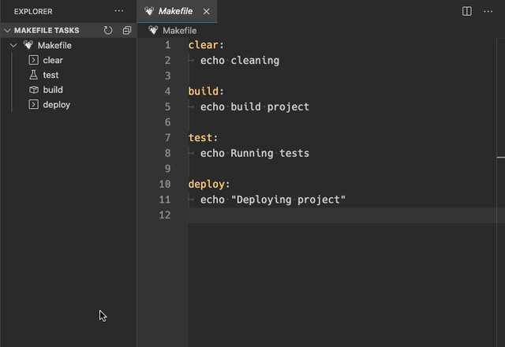

# Make support and task runner

Run `make` tasks and targets from VS Code command picker or via tasks menu.

## Features

- Run `Make` from command picker
  - You can assign a shortcut to the command `make-task-provider.runTarget` and it will list all the available tasks to choose.
- List make as an option from the VS Code task runner menu
  - **Terminal -> Run task**
- Tasks-View listing all available targets
- Multiple workspaces ready!
- **NEW**: Set the executable path to your `make` command
- **NEW**: Add extra arguments to the `make` execution command

### Running from the command picker:


### Running from the tasks view:



### Adding extra arguments/flags to the `make` execution command

The setting `make-task-provider.extraArguments` can be set with an array of strings with extra arguments which will be added to the `make` command.

```json
"make-task-provider.extraArguments": [
  "--always-make",
  "--ignore-errors"
]
```

Extra arguments will be appended to the `make` command as follows:

```text
[make bin path] -f [makefile path] [...extra arguments] [target name]
```

For example, If the target `build` is triggered, it will be executed as:

```shell
$ make -f ./Makefile --always-make --ignore-errors build
```

It is also possible to customize flags to a single target by using VSCode task customization:

On your project's `tasks.json`, set the following:

```json
{
  "version": "2.0.0",
  "tasks": [
    {
      "type": "make",
      "targetName": "build",
      "makeFileRelativePath": "Makefile",
      "problemMatcher": [],
      "label": "make: build with extra args",
      "args": [
        "--always-make",
        "--ignore-errors"
      ]
    }
  ]
}
```

If `make-task-provider.extraArguments` is set along with `args` in the tasks.json,
**ALL** the extra arguments will be added to the `make` command.

---

**PS:** This extension is **NOT** a re-implementation of `make`, so you must have `make` executables available on your system.

If `make` is not on your `PATH`, you can customize the executable path individually based on your operating system:

| OS      | Settings                                    | Example                                  |
| ------- | ------------------------------------------- | ---------------------------------------- |
| Windows | `make-task-provider.windows.makeExecutable` | "C:\\Program Files\\make\\bin\\make.exe" |
| Linux   | `make-task-provider.unix.makeExecutable`    | "/usr/bin/make"                          |
| Mac OS  | `make-task-provider.osx.makeExecutable`     | "/usr/bin/make"                          |
